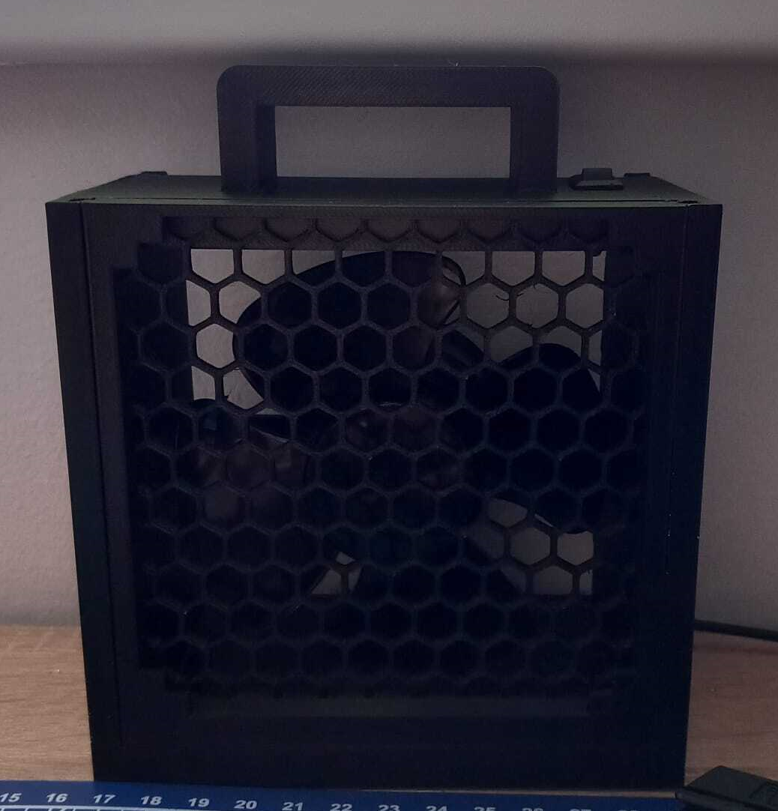

# Solder Fume Extractor

A DIY solder fume extractor crafted from a simple USB office fan.

Before:

After: 

## Description

This repository provides all the necessary files and instructions to build a solder fume extractor using a repurposed USB office fan. The 3D models have been designed in Autodesk Fusion 360 and are optimized for printing on standard 3D printers.

## Requirements

To create your own solder fume extractor, you'll need:

- **3D Printer**: A printer with a minimum bed size of 18x18x18 cm.
- **Filament**: PLA is recommended, but other materials may also be suitable.
- **USB Office Fan**: Ensure the fan has three screws on the back for secure attachment.                   
   [Example link to purchase fan](https://www.amazon.de/CSL-Ventilator-Tischventilator-Schreibtisch-Aus-Schalter/dp/B00CHI1H2S/ref=sr_1_4?c=ts&dib=eyJ2IjoiMSJ9.cBtV1WOy4gSJNRHsdfewkNupaOAsGHvQfvXs085vNl-25TXbkvKGLYiuOcQMoZKeZvJPTW8MhVsoEH7ShmjRX51srN_0OP18g-xJVtIqSEQM--1lr4pHPptYPQf2dNwuA5X3rmH8z6sftNo_wjsnQW0ByATdVkpUNFZ0GTKPOpwB_mFDzGquWJwPchUL8ISH7f1mtPutMm7fWiY91W7SxOfDE4NfRiBbDruJfK2DnPtOaa2Orn8FJQSaMIZW1GTJNTbik8oi5zNp9Zxx5vn5-yIvmYv8c1oVKGfsURIwOe4.yK55g2qv8X8xk4HLBKC9rneMekb6bDEJsGp4SBnHztA&dib_tag=se&keywords=USB-Ventilatoren&qid=1724481674&s=computers&sr=1-4&ts_id=9638139031)       
[Another example link to purchase fan](https://www.allbranded.at/p/USB-Ventilator-schwarz-ohne-Werbeanbringung/?inclVat=1&utm_term=&utm_campaign=AT+-+Pmax+%7C+Sales&utm_source=adwords&utm_medium=ppc&hsa_acc=6016211787&hsa_cam=17689874077&hsa_grp=&hsa_ad=&hsa_src=x&hsa_tgt=&hsa_kw=&hsa_mt=&hsa_net=adwords&hsa_ver=3&gad_source=1&gclid=CjwKCAjw5qC2BhB8EiwAvqa41u_92KyXhaWNxLk88X6SxJ71AOgNLwzx0Qw62aSb4yffwn7fJFlaZhoCvUAQAvD_BwE)
- **Charcoal Filter (Front)**: Any filter up to 0.5mm thick.
- **HEPA Filter (Back)**: Any filter up to 0.5mm thick.

## Assembly Instructions

1. Download the files labeled "Filter Back," "Filter Front," and "Fume Extractor Main" from the `/finished` folder.
2. Import these files into your preferred slicer software.
3. Print the components using your 3D printer.

*Note*: Additional files such as screws and nuts are included for potential future enhancements (e.g., solder arms or adjustable arms). These components are optional and not required for the basic fume extractor assembly.

The estimated filament usage is:
- **Filter components**: 140g to 180g per filter (multiply by 2 for both filters).
- **Main part**: Approximately 260g.

## Usage Warning

**Important**: If you intend to print the screws and nuts, apply an XY Compensation of 0.1 to 0.15mm (e.g., in Bambu Slicer). This adjustment is essential to ensure proper fit and functionality of the screws and nuts.

## Contributing

Contributions are welcome! If you enhance or update this project, please use the provided screw and nut files from the `/finished` folder. This will help maintain compatibility with the existing design and avoid measurement issues.

When contributing, ensure that all relevant tests and validations are updated accordingly.

## License

This project is licensed under the MIT License. See the [LICENSE](https://pitt.libguides.com/openlicensing/MIT) file for more details.
